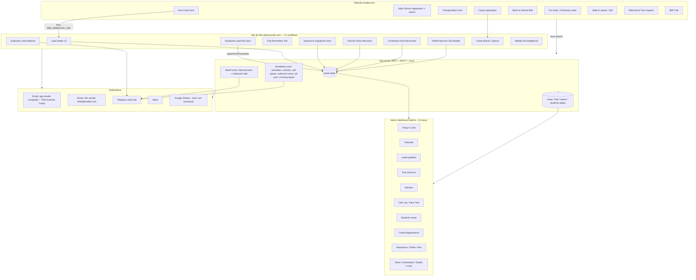

# TMA CRM: Full Audit and Restructure Plan

Author: Claude (2026-07-25). Purpose: map the entire TMA system end to end (website, dashboard, server automations, n8n, notifications, data), name every overlap and gap, and lay out a clean structure that any TMA staff member can understand. No code has been changed by this document; it is the plan we build from.

---

## 1. TL;DR (the diagnosis in five lines)

1. **The data model is good; the organization is not.** Leads already have a proper 9-stage pipeline. The problem is that everything (orders, enrolled families, waiver signers, camp interest) gets dumped into the same lead pile with no "type," so staff cannot tell a hot prospect from a paying customer.
2. **Two brains run the automation.** The app's own scheduled jobs AND 11 n8n workflows both act on leads. They overlap (no-show, reminders, intake alerts, Retell calls) and nobody owns a single job end to end.
3. **Emails go out under two different identities.** The app sends from `TMA Summer Camp <noreply@tmatkd.com>`; n8n sends from `hello@tmatkd.com`. So one family can get mail from two "brands," and every app email is mislabeled "Summer Camp."
4. **Small bugs add noise.** Broken Telegram tags, generic "New Free Class Inquiry" alerts for non-free-class leads, no dedupe on web forms, an invisible after-school payment path, and stale docs.
5. **The fix is mostly organization, not rebuild:** add a record type, filter the pipeline to real prospects, give each population its own home, assign each automation a single owner, and unify the sender identity.

---

## 2. How the system works today (end to end)

### 2a. Website intake forms (where each one lands)
| Form (route) | Writes to | Type it really is |
|---|---|---|
| Free class (`/free-class`) | `leads` (new_lead) + fires n8n intake | **Prospect** |
| Afterschool tour (`/afterschooltour`) | `leads` | **Prospect** |
| $99 trial (`/enroll` flow, staff) | `trialEnrollments` + flips lead `trial_scheduled` | **Prospect in trial** |
| After-School registration + waiver (`/afterschool-register`) | `leads` (new_lead) + `waivers` | **Enrolled customer** |
| Transportation (`/transportation`) | `leads` + `waivers` | **Enrolled customer (form)** |
| Back-to-School $49 (`/back-to-school`) | `leads` (new_lead) | **Paid trial buyer** |
| Pro-shop / Christmas (`/christmas-in-july`) | `leads` (new_lead) | **Order / customer** |
| Walk-in waiver / QR (`/walkin`, `/enroll`) | `leads` + `waivers` | **Depends (prospect or enrolled)** |
| Camp registration (`/camp-registration`) | `campRegistrations` only (clean) | **Camp registrant** |
| After-School Care payment (createIntent) | **nothing** (Stripe metadata only) | **Invisible customer (gap)** |

The right-hand column is the whole problem: five different "types" all become `new_lead` rows in one pile.

### 2b. Dashboard views (16, current grouping)
Leads group: Today's Calls, Calendar, Leads pipeline, Trial Check-in, Waivers. Calls group: Call Log, Voice Test. Growth: Email Sequences, Routing Rules, Ad Performance. Roster: Students, Camp Registrations. System: Links, My Tasks, Automation, Studio. Default view = Leads.

### 2c. Automations, by owner
**App server (Heartbeat crons + voice), fired at `/api/scheduled/*`:**
- Morning report (~11:30a), Trial reminders AM staff Telegram (~8a), Trial check-in PM "did they show?" (~8:30p), Daily call queue to Telegram (~8a), Outbound Retell calls (speed-to-lead, no-show, post-trial, afterschool-tour), FB ad-insights sync. Retell inbound tools + `call_analyzed` webhook.

**n8n (11 workflows):** Lead Intake v3 (active) / v2 (inactive), Sequence Dispatcher (5 min), Trial No-Show Recovery (9a email), Trial Reminders 24h (9a customer email), Enrollment Auto-Reconciler (8a), Facebook Lead Ads Sync (15 min), Duplicate Lead Detector (7a), Retell Inbound Call Handler (`call_ended`), Camp Waiver Capture, Weekly Ad Intelligence (Mon 8a).

### 2d. Notification channels
- **Email via app:** every app email flows through one `sendEmail()` with a hardcoded `from: 'TMA Summer Camp <noreply@tmatkd.com>'`.
- **Email via n8n:** Resend from `hello@tmatkd.com`.
- **Telegram:** one staff chat, hand-labeled per event (the cleanest channel).
- **Slack:** always titled "New Free Class Inquiry" regardless of source.
- **Google Sheets:** JWT signing is a stub, so the export is effectively non-functional.

---

## 3. What is broken, overlapping, or missing (prioritized)

### P0 — actively hurts operations
1. **Non-prospects pollute the lead pile and the call board.** Pro-shop orders, back-to-school buyers, enrolled after-school families, and every waiver signer land as `new_lead`, and "Today's Calls" tells staff to cold-call them ("new lead, call fast"). Root: no record type; only fragile opt-in tags. (`server/db.ts` createLead + getCallBoard; `routers.ts` order/afterschool/back-to-school paths.)
2. **All app email is mislabeled "TMA Summer Camp."** One line: `integrations.ts:188`. Taints martial-arts leads, trial receipts, transportation, after-school mail.
3. **Two email identities** (`noreply@` "Summer Camp" vs `hello@tmatkd.com`) make the brand look inconsistent to the same family.

### P1 — overlaps and duplication (two brains)
4. **No-show is handled three ways, uncoordinated:** app Telegram "did they show?" + n8n no-show recovery emails + app outbound Retell no-show call. A single no-show can trigger all three with no shared owner.
5. **Reminders split:** app sends STAFF Telegram "trials today"; n8n sends CUSTOMER 24h email. Complementary today, but two systems own "reminders," so a change needs edits in both places.
6. **Two Retell inbound handlers exist:** app `call_analyzed` webhook AND n8n "Retell Inbound Call Handler" (`call_ended`). Confirm which one Retell is actually pointed at; if both, staff get double alerts and the lead is touched twice. (Verify in Retell dashboard before consolidating.)
7. **Two intake alert paths:** app fires Slack + staff email on `leads.submit`; n8n Lead Intake v3 also alerts staff (when unsegmented). Overlap on new-lead notifications.

### P2 — gaps and quick wins
8. **No dedupe on web forms.** Free-class, back-to-school, and order forms always create a new row. n8n "Duplicate Lead Detector" exists only because the app never prevents the dupe. Fix at the source (match-by-email/phone on submit).
9. **After-School Care payment saves no DB row** (Stripe metadata only) — those paying customers are invisible in the dashboard.
10. **Facebook sync stamps everything "Summer Camp 2026"** (`programInterest`, `utmCampaign`, tag), a leftover from the summer campaign, so FB leads look like camp leads.
11. **Labeling bugs:** three malformed Telegram tags (`<\b>` renders literally) in `routers.ts:1783`, `routers.ts:2308`, `voice-routes.ts:448`; Slack + generic staff email always say "Free Class Inquiry"; pipeline badges show raw values ("In-person sign-up", "summer_camp"); a duplicate dead branch in `LeadsPipeline.tsx:65-66`.
12. **Google Sheets export is a non-functional stub.** Either finish it or remove it.
13. **Docs drift:** `docs/WORKFLOWS.md` lists 5 workflows; 11 exist. Whatever we build must keep one current source of truth.
14. **Security (passing note):** admin email + password are hardcoded in the client bundle at `pages/AdminRegistrations.tsx:34-35` (legacy redirect-only shell). Should be removed.

---

## 4. Proposed restructured system

The guiding rule: **one population = one home, one job = one owner, one brand = one sender.**

### 4a. Data: add a first-class `record_type`
Add `record_type` to `leads`: `prospect | trial | enrolled | order | form_only`. Set it at every creation path (free-class + tour + FB = `prospect`; $99 / back-to-school = `trial`; after-school registration = `enrolled`; pro-shop / Christmas = `order`; standalone waiver/transportation with no trial intent = `form_only`). Camp already has its own table; leave it.

Then filter by type where it matters:
- Leads pipeline, Today's Calls, and the daily call queue default to `record_type IN (prospect, trial)`. Orders and enrolled families never appear in the "not contacted" pile again.
- This replaces the fragile tag filtering with a reliable field.

### 4b. Dashboard: five clear sections a new staffer can navigate
1. **Prospects** (the sales pipeline): Today's Calls, Calendar, Leads board, Trial Check-in. Only real prospects/trials. This is where "did they come in? do we call them?" lives.
2. **Enrolled Families**: Students roster, $99 trials, after-school enrolled families. Pulled out of the lead pile.
3. **Orders**: pro-shop / Christmas / back-to-school purchases as an order list, not pipeline cards.
4. **Camp**: unchanged (already the clean model).
5. **Forms & Calls**: Waivers, Transportation forms, Call Log, Voice Test.
Plus a small **System** area (Sequences, Rules, Ads, Automation, Tasks, Studio, Links) that staff rarely touch.

### 4c. The unified Prospect board (the "neat page" requested)
One list of all prospects, past and present, each row showing: name + program, stage (color chip), trial date/time, showed / no-show, a "call them" flag, last touch, and quick actions (call, text later, mark showed, book, mark enrolled). It reads from the same data the Calendar and Check-in use, so nothing drifts. Filters: stage, program, "needs a call," date range.

### 4d. Automations: one owner per job
Draw a hard line so no job runs in two places:
- **Keep in n8n (customer-facing email sequences + external syncs):** Lead Intake nurture, Trial Reminders 24h (customer), No-Show Recovery email, Enrollment Reconciler, FB Lead Ads Sync, Weekly Ad Intelligence, Camp Waiver Capture.
- **Keep in the app (real-time + staff-facing + voice):** intake staff alert, Telegram operational pings, daily call queue, trial check-in prompt, outbound Retell calls, ad-insight sync feeding the dashboard.
- **Resolve the overlaps:** pick ONE Retell inbound handler (app or n8n, not both); make no-show a single coordinated sequence (one system decides: email + optional call, not three independent triggers); fold dedupe into the submit path and keep the Duplicate Detector only as a safety alarm.

### 4e. Notifications: one identity, correct labels
- Single sender identity across app + n8n. Recommend `Top Martial Arts <hello@tmatkd.com>` everywhere (retire the "Summer Camp" from-name). Per-email subjects already vary correctly; just fix the from-name and the generic staff/Slack titles so they name the real source.
- Fix the three Telegram tags and the badge labels.
- Decide Google Sheets: finish signing or remove.

### 4f. The staff mental model (what "easy to understand" means here)
A one-page "where do I look" for staff:
- New person interested? -> **Prospects** (call them, book a trial).
- Trial today? -> **Prospects > Check-in** (mark showed / no-show).
- Already signed up? -> **Enrolled Families**.
- Someone bought gear or a package? -> **Orders**.
- Camp? -> **Camp**. Signed a form? -> **Forms & Calls**.
Every alert (Telegram/email) links straight to the right section.

---

## 5. Phased implementation plan

- **Phase 1 (ship first, no external dependencies): classification + labeling.** Add `record_type`, set it at every creation path, filter pipeline + call board to prospects, fix the sender identity + Telegram tags + badges + staff/Slack titles, add submit-time dedupe, remove the leaked admin creds. Result: the pile is clean and mail is correctly branded.
- **Phase 2: dashboard IA + unified Prospect board.** Regroup the 16 views into the five sections, build the single prospect board, give Orders and Enrolled Families their own views, capture the standalone after-school payment as a real row.
- **Phase 3: automation consolidation.** Pick one Retell handler, make no-show a single coordinated flow, define the app/n8n boundary, and rewrite `docs/WORKFLOWS.md` as the one current source of truth (all 11 + app crons).
- **Phase 4 (separate track): SMS follow-up bot.** Twilio + A2P 10DLC. Behavior locked by owner: first text 5 minutes after a prospect comes in with no booking, nudge next day and day 3, stop on reply-book or opt-out, conversational tone, books directly (if no slot fits, tell them staff will reach out).

---

## 6. Decisions (owner, 2026-07-25)
1. **Sender identity: LOCKED.** Standardize app + n8n on `Top Martial Arts <hello@tmatkd.com>`. Retire the `TMA Summer Camp` from-name.
2. **Orders + Enrolled Families: LOCKED.** Build dedicated dashboard views for each (not just a filter).
3. **No-show contact policy: DEFERRED to Phase 3.** Leave the current behavior until we consolidate; revisit email-only vs email + one Retell call then.
4. **Staff visual map: LOCKED (yes).** A one-page front-desk "where do I look" guide. Built as `docs/tma-crm-map.html`; best final home is a `/admin` page inside the dashboard (or an Artifact once publishing is re-authorized) so staff can actually reach it.
5. Still open: Retell inbound handler (app vs n8n) needs a look at the Retell dashboard webhook URL before consolidating. Google Sheets export (finish signing or retire) can be decided in Phase 3.

## 7. Phase 1 build scope (next up)
Locked and ready to build:
- Add `record_type` to `leads` (idempotent migration) and set it at every creation path.
- Filter the Leads pipeline + Today's Calls + daily call queue to `record_type IN (prospect, trial)`.
- Change the app email sender to `Top Martial Arts <hello@tmatkd.com>`; align n8n later.
- Specialize the generic staff + Slack notification titles by source.
- Fix the three malformed `<\b>` Telegram tags (`routers.ts:1783`, `routers.ts:2308`, `voice-routes.ts:448`).
- Add badge labels for `In-person sign-up`, `Pro Shop`, `summer_camp`; remove the duplicate `back_to_school_2026` branch.
- Add submit-time dedupe (match by email/phone) on the free-class and order paths.
- Remove the hardcoded admin credentials from `pages/AdminRegistrations.tsx`.
