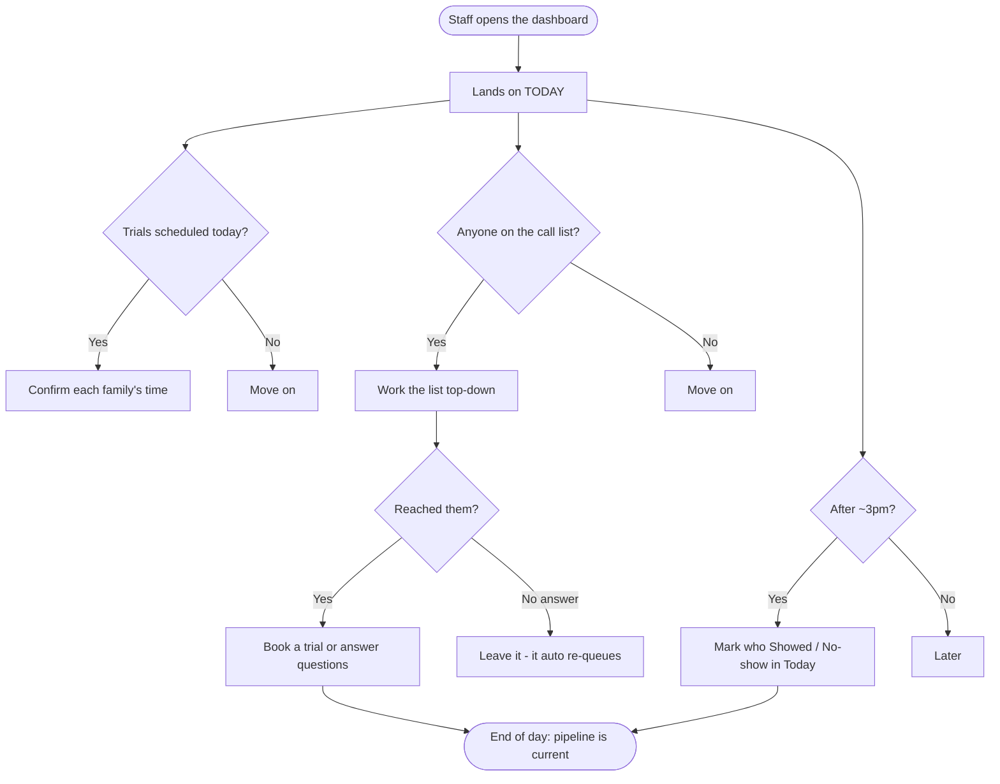
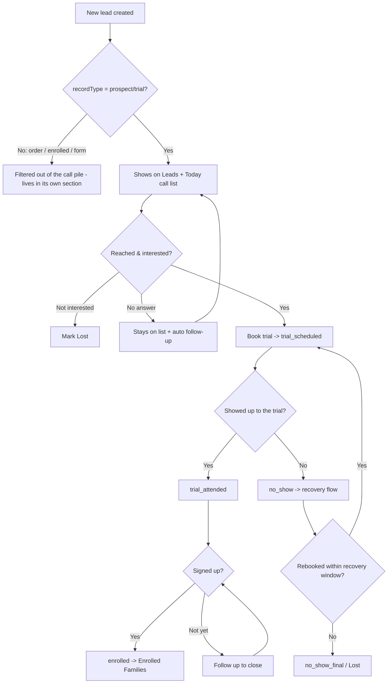
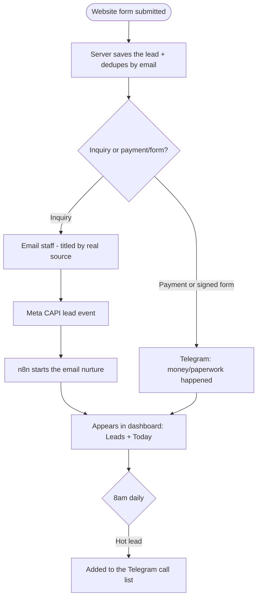
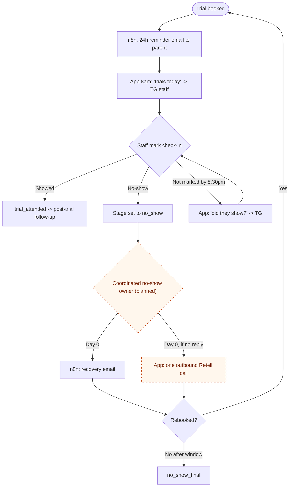
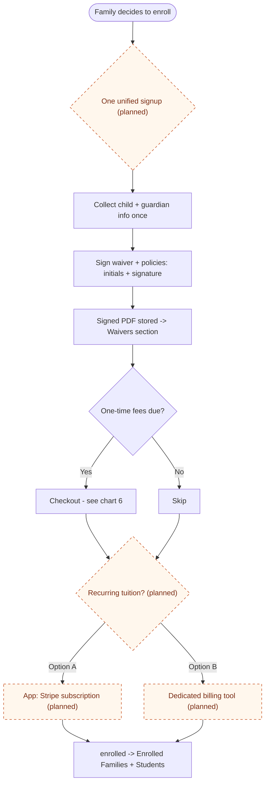
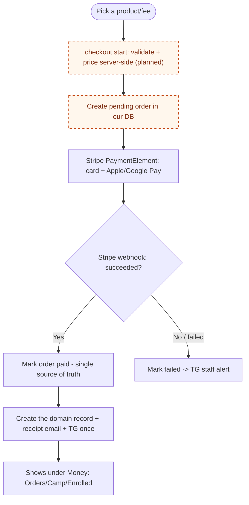
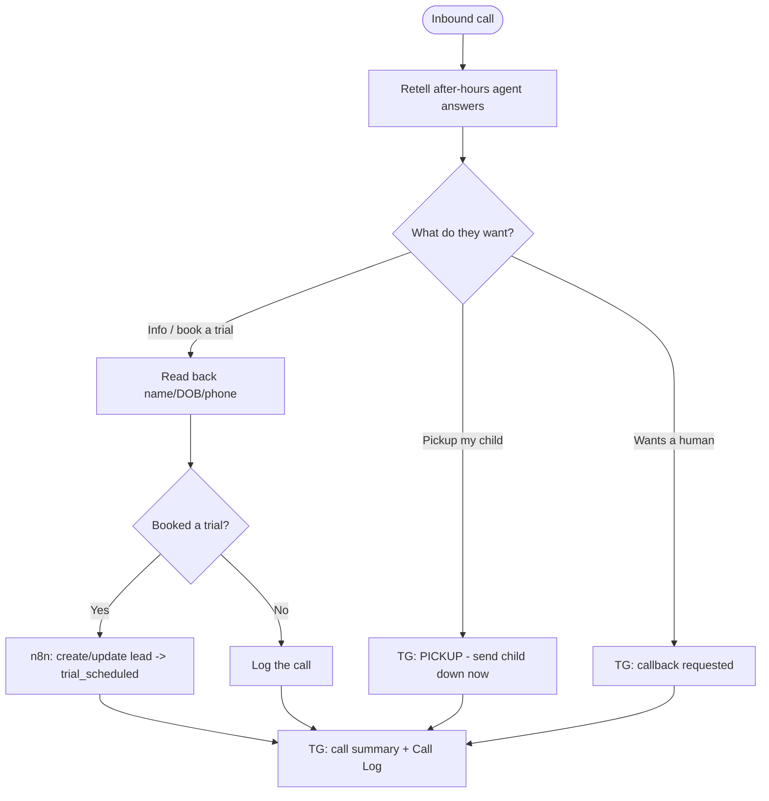
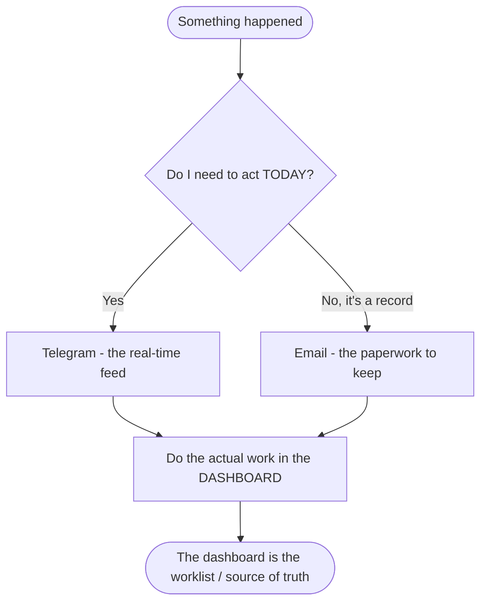
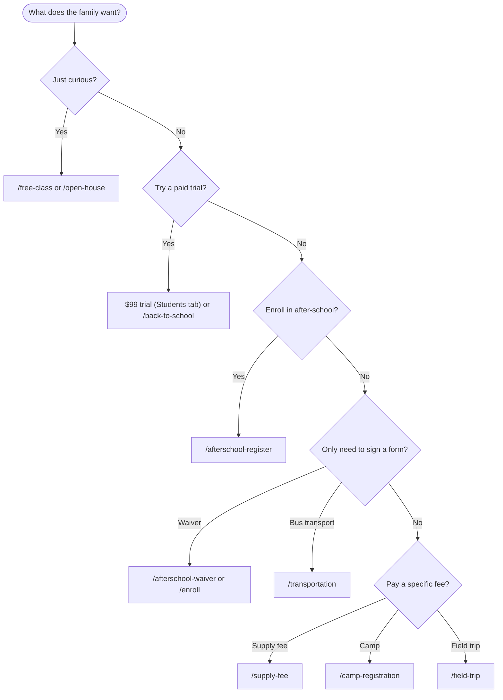

# TMA Workflow Flowcharts (Target State)

If/then flowcharts for how TMA runs once the restructure lands. Covers both what **staff do** and the **behind-the-scenes automations**. These render as diagrams in Obsidian, GitHub, and VS Code (mermaid).

**Legend:** solid = built today · **dashed = planned** (Phase 2/3: unified signup, in-app tuition, coordinated no-show). `hello@` = customer email, TG = Telegram staff alert.

---

## 1. Front-desk daily driver (open → close)



---

## 2. Lead lifecycle (the master pipeline)



---

## 3. New lead intake (automation)



---

## 4. Trial reminders + no-show recovery (automation, coordinated)



---

## 5. Sign-up + waiver (target: unified)



---

## 6. Payment / checkout (target: one shared flow)



Note: today each product has its own page + confirm; the planned shared flow collapses them and makes the **webhook** authoritative so a double confirm never double-charges or double-alerts.

---

## 7. Inbound phone call (Retell voice agent)



---

## 8. Where do I find out about X? (alerting rule)



---

## 9. Which link do I send? (staff decision tree)



---

*Shared styling for planned nodes:*
```mermaid
%% add to any chart:
%% classDef planned fill:#fff7ed,stroke:#c2410c,stroke-dasharray:5 5,color:#7c2d12;
```
